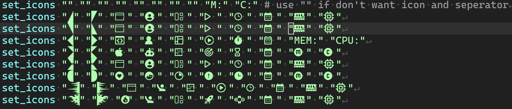
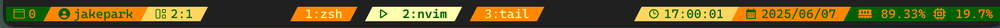
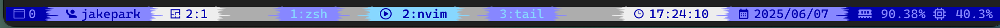

# tmux-status

> `jpark6/tmux-status` is simple tmux status plugin

## Preinstall
### Nerd Font
[Nerd Font github page](https://github.com/ryanoasis/nerd-fonts)
Need to install the Nerd Font for the icons to display properly.

This README.md page not support Nerd Font
Therfore below codes `set_icons` icons just display box characters
icon:


### plugins
If want to see mem/cpu usage percent  
Install [thewtex/tmux-mem-cpu-load](https://github.com/thewtex/tmux-mem-cpu-load)

## Install
### Tmux Plugin Manager (TPM)

add in `~/.tmux.conf`
```shell
set -g @plugin 'jpark6/tmux-status'
```

### Manual
Clone this repository in your `$HOME/.tmux/` directory:

```shell
git clone https://github.com/jpark6/tmux-status.git $HOME/.tmux/plugins/tmux-status
```

add to  `.tmux.conf` file:

```shell
run $HOME/.tmux/plugins/tmux-status/tmux-status.tmux
```

## Usage
- change `tmux-status.tmux` and reload plugin
1. change `tmux-status.tmux` main function
```shell
main() {
  ...
  # change below 2 lines
  set_color "default" "#16610E" "#F97A00" "#FED16A"  # green orange
  set_icons "" "" "" "" " " " " " " " " " " "󰸗 " " " " "

  status_left
  status_center
  status_right

  tmux set -g pane-active-border-style "fg=$color1"
}

```
2. reload `tmux-status.tmux` plugin
  - Reload tmux
    - press \<prefix\>+I (default: \<C-b\>+I)
  - or run `tmux-status.tmux`
    - press \<prefix>+: and type `:run /path/to/plugin/tmux-status.tmux`
    - type command in shell: `tmux run /path/to/plugin/tmux-status.tmux`

### Default 
- default color if don't set colors & icons
- separator : /
- color: green orange yellow
```shell
bg_c="default" # statusbar bg color
c1="#16610E" # session & MEM CPU bg color
c2="#F97A00" # username & date bg color
c3="#FED16A" # pane & time bg color

section_l_icon=""
section_r_icon=""
sp_l_icon=""
sp_r_icon=""
session_icon=" "
user_icon=" "
pane_icon=" "
curr_icon=" "
time_icon=" "
date_icon="󰸗 "
mem_icon=" "
cpu_icon=" "
```


### Rounded Separators & Cyberpunk
```shell
  set_color "default" "#541690" "#FF4949" "#FFCD38"  # cyberpunk - purple pink orange
  set_icons "" "" "" "" "󰥱 " "󰙄 " "󰪟 " "󰀨 " "󱑁 " "󰸗 " "󰰐 " "󰯲 "
```


### Triangle Separators & Nord Color 
```shell
  set_color "deafult" "#88C0D0" "#2E3440" "#FFFFFF" # Nord
  set_icons "" "" "  " "  " "󱃸 " " " "󱪳 " " " "󱎫 " "󰸘 " "MEM:" "CPU:"
```


### Inverse Triangle & Neon (Ansi Color - no hex color)
- Can Use ANSI Color
```shell
  set_color default teal yellowgreen cyan yellow # Neon
  set_icons "" "" "" "" " " "󱚟 " "󰠡 " "󰣉 " "󱦟 " "󰸗 " "󰰐 " "󰯲 "
```


### Wave Separators & Cold (status background light)
```shell
  set_color "light" "#11009E" "#4942E4" "#8696FE"  # cold - navy blue purple
  set_icons " " "" "" "" " " "󱎂 " "󰠡 " "󱝆 " "󰚱 " "󰸗 " " " " "
```


### Flame Separators & Red pearch Green
```shell
  set_color "default" "#A62C2C" "#E83F25" "#EA7300"  # flame red orange yellow 
  set_icons " " "" "|" "|" "󱠇 " "󰙊 " " " "󱓞 " "󱦟 " "󰸗 " " " " "
```


### No Seraprator No Icon & Olive Gray Color
```shell
  set_color "dark" "#626F47" "#A4B465" "#F5ECD5"  # gray olive
  set_icons "" "" "" "" "" "" "" "" "" "" "" "" # use "" if don't want icon and seperator
```


