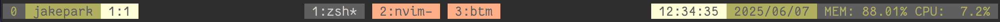

# tmux-status

`jpark6/tmux-status` is simple tmux status plugin


default 
```shell
status_bg_color="default" # statusbar background color
color1="#16610E" # session & current windows background color
color2="#F97A00" # session & current windows foreground color
color3="#FED16A" # username background color
color4="#FFF4A4" # inactive windows background color

separator_start_icon=""
separator_end_icon=""
session_icon=" "
user_icon=" "
pane_icon=" "
status_current_icon=""
time_icon=" "
date_icon="󰸗 "
host_icon=" "
```


if want to change colors & icons & separators
change `tmux-status.tmux` file's main function code

## examples
rounded separators & cyberfunk color
```shell
  set_color "default" "#541690" "#FF4949" "#FF8D29" "#FFCD38" # cyberpunk - purple pink orange
  set_icons "" "" "󰥱 " "󰙄 " "󰪟 " "󰀨 " "󱑁 " "󰸗 " "󱁍 "
```


wave separators & cold color
```shell
  set_color "light" "#11009E" "#4942E4" "#8696FE" "#C4B0FF" # cold - navy blue people
  set_icons " " " " " " " " " " " " " " "󰸗 " " "
```


flame separators & red pearch green
```shell
  set_color default "#FF3F33" "#FFE6E1" "#075B5E" "#9FC87E" # red peach green 
  set_icons " " "" "󱠇" "󰙊 " " " "󱓞 " "󰚱 " "󰸗 " " " " "
```


No seraprators & No icon and olive gray color
```shell
  set_color "dark" "#626F47" "#A4B465" "#F5ECD5" "#F0BB78" # gray olive
  set_icons "" "" "" "" "" "" "" "" "" # use "" if don't want icon and seperator
```



## install
### Tmux Plugin Manager (TPM)

add in `~/.tmux.conf`
```shell
set -g @plugin 'jpark6/tmux-status'
```

### Manual
Clone this repository in your `$HOME/.tmux/` directory:

```shell
git clone https://github.com/jpark6/tmux-status.git $HOME/.tmux/plugins/tmux-status
```

add to  `.tmux.conf` file:

```shell
run $HOME/.tmux/plugins/tmux-status/tmux-status.tmux
```

## plugins
if want to see mem/cpu usage percent  
install [thewtex/tmux-mem-cpu-load](https://github.com/thewtex/tmux-mem-cpu-load)


