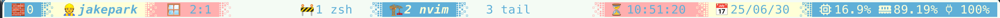
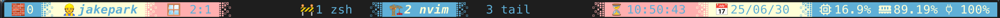

# tmux-status

> `jpark6/tmux-status` is simple tmux status plugin

## Preinstall
### Nerd Font
[Nerd Font github page](https://github.com/ryanoasis/nerd-fonts)
Need to install the Nerd Font for the icons to display properly.
- Not use Nerd Font

- Use Nerd Font


### plugins
[thewtex/tmux-mem-cpu-load](https://github.com/thewtex/tmux-mem-cpu-load)
- show cpu mem percentage

[tmux-plugins/tmux-battery](https://github.com/tmux-plugins/tmux-battery)
- show battary status and percentage


## Install
### Tmux Plugin Manager (TPM)

- add in `~/.tmux.conf`
```shell
set -g @plugin 'jpark6/tmux-status'
```

### Manual
- Clone this repository in your `$HOME/.tmux/` directory:

  ```shell
  git clone https://github.com/jpark6/tmux-status.git $HOME/.tmux/plugins/tmux-status
  ```

- add to  `.tmux.conf` file:

  ```shell
  run $HOME/.tmux/plugins/tmux-status/tmux-status.tmux
  ```

### Install Plugin
- For both TPM and Manual methods, you must enter the install command.
  ```shell
  <prefix>+I # default tmux <prefix> is Ctrl+b
  ```

## Usage
- change `~/.tmux.conf`  and reload plugin
1. set options in `~/.tmux.conf` 
  - You can change it to any colors, icons or separators.
  - colors : "status_bg,color1,color2,color3"
    - status_bg : default: transparent, dark/black : theme dark color, light/white : theme light color, #[A-Fa-f0-9]{6} : rgb hex color
    - color1 : main color, color2 : sub color, color3 : third color
  - separators "section_left_icon,section_right_icon,separator_left_icon,separator_right_icon"
  - icons "session,user,pane,current window,prev windows,time,date,cpu,memory,charged,discharged,charging"
```shell
# example color, icons, separators, user name, mem, cpu
set -g @tmux-status-colors "default,#FD8A8A,#F1F7B5,#A8D1D1" 
set -g @tmux-status-separators ",,｜,｜," 
set -g @tmux-status-icons "🖥 ,🤖 ,🪟 ,🎯,✨,⏳️,📅, , ,⚡️ ,🪫,🔋,"
set -g @tmux-status-show-user-name on
set -g @tmux-status-show-cpu-mem off
set -g @tmux-status-show-battery on
```
- example options screenshot
- light terminal theme

- dark terminal theme


2. reload `tmux-status.tmux` plugin
  - Reload tmux
  ```shell
  <prefix>+I # default tmux <prefix> is Ctrl+b
  ```

## Colors & Separators & Icons
### Default
- if not set options in `~/.tmux.conf`
- applied default options 
  - separator : `` # right upper triangle
  - color: green orange yellow
  - icon: normal icons
  - user name : on
  - cpu mem : off


### Rounded Separators & Cyberpunk & round icons
```shell
set -g @tmux-status-colors "default,#541692,#FF4949,#FFCD38"
set -g @tmux-status-separators ",, , ,"
set -g @tmux-status-icons "  ,󰙄 ,󱪳 , , ,󱎫 ,󰸘 ,󰯲 ,󰰐 ,󰚥 , ,󰂄 ," # play round
```


### Triangle Separators & Nord Color & emoji icons 
```shell
set -g @tmux-status-colors "default,#88C0D0,#2E3440,#FFFFFF"
set -g @tmux-status-separators ",, , ,"
set -g @tmux-status-icons "🖥 ,🤖 ,🪟 ,🎯,✨,⏳️,📅, , ,⚡️ ,🪫,🔋," # target emoji

```


### Pixel Separators & Pastel & Construction emoji icons
```shell
set -g @tmux-status-colors "default,#6EABD6,#FEFBC7,#FFB4B4" # PastlCyan2 - more bright
set -g @tmux-status-separators " , ,,," # pixel
set -g @tmux-status-icons "🧱,👷,🪟 ,🏗 ,🚧,⏳️,📅, , , ,󱊢 ,󱊥 ," # construction emoji

```



### Wave Separators & Cold & beach icons
```shell
set -g @tmux-status-colors "default,#006DFA,#8CB2F1,#D0CEDD"
set -g @tmux-status-separators " ,,,,"
set -g @tmux-status-icons "󰞍 ,󱝆 ,󱢋 ,󱢴 ,󱁕 ,󰄉 ,󰸗 , , , ,󰁾 ,󰢝 ," # wave
```


### Flame Separators & Red
```shell
set -g @tmux-status-colors "default,#A62C2C,#E83F25,#EA7300"
set -g @tmux-status-separators " ,, , ,"
set -g @tmux-status-icons "󱠇 ,󰙊 , ,󱓞 , ,󱦟 ,󰸗 , , , ,󰁾 ,󰢝 ," # hello

```


### No Separator No Icon & Olive 
```shell
set -g @tmux-status-colors "default,#627F47,#A4B465,#F5ECD5"
set -g @tmux-status-separators ", "
set -g @tmux-status-icons ", "
```


## User Name
- I think the username is always the same value,
- so it doesn't matter if it's not displayed,
- so I made it an on/off option.
- default : on
### No User Name
```shell
set -g @tmux-status-show-user-name "off" # off or "off"
```


### Show User Name
```shell
set -g @tmux-status-show-user-name "on" # on of "on"
```


## CPU & Memory
### No CPU & Memory Info
- If you don't want to see cpu mem info
- or not install [thewtex/tmux-mem-cpu-load](https://github.com/thewtex/tmux-mem-cpu-load) plugin
- default : off
```shell
set -g @tmux-status-show-cpu-mem "off" # off or "off"
```


### Show CPU & Memory Info
```shell
set -g @tmux-status-show-cpu-mem "on" # on or "on"
```


## battery
### No battery Info
- If you don't want to see battery info
- or not install [tmux-plugins/tmux-battery](https://github.com/tmux-plugins/tmux-battery) plugin
- default : off
```shell
set -g @tmux-status-show-battery "off" # off or "off"
```


### Show Battery Info
```shell
set -g @tmux-status-show-battery "on" # on or "on"
```


##  Presets
- I commented the presets in `tmux-status.tmux`
- You can apply those settings to the `~.tmux.conf` file. 
- Or you can apply any other settings.

- `tmux-status.tmux`
```shell
  # Examples of colors / separators / icons
  # color references : https://colorhunt.co/
  set -g @tmux-status-colors "," # no colors - bg: transparent fg : theme main color
  set -g @tmux-status-colors "default,#16610E,#F97A00,#FED16A" # Forest - green orange yellow
  set -g @tmux-status-colors "default,#626F47,#A4B465,#F5ECD5" # OliveGray - olive gray white
  set -g @tmux-status-colors "default,#541690,#FF4949,#FFCD38" # Cyberpunk - purple pink orange
  set -g @tmux-status-colors "default,#050C9C,#3572EF,#3ABEF9" # Ocean - blue lightpurple skyblue
  set -g @tmux-status-colors "default,#FCC737,#F27B0F,#7E1891" # NeonYellow - yellow orange purple
  set -g @tmux-status-colors "default,#952F7C,#45CC38,#CAAC00" # NeonPurple
  set -g @tmux-status-colors "default,#EFE4D2,#254D70,#2F80BF" # WhiteGreen - white green blue
  set -g @tmux-status-colors "default,#96624C,#CC8A6A,#FABB85" # Coffee
  set -g @tmux-status-colors "default,#139E74,#BAFFE5,#E2FFF4" # Mint
  set -g @tmux-status-colors "default,#A62C2C,#E83F25,#EA7300" # Flame - red orange yellow 
  set -g @tmux-status-colors "default,#88C0D0,#2E3440,#FFFFFF" # Nord - skyblue darkgray white
  set -g @tmux-status-colors "default,#0A0047,#00FFD2,#FF4499" # TokyoNight - darkblue teal pink
  set -g @tmux-status-colors "default,#1A5319,#80AF81,#D6EFD8" # GradientGreen - gree dark → light
  set -g @tmux-status-colors "default,#AA60C8,#D69ADE,#FFDFEF" # GradientPurple
  set -g @tmux-status-colors "default,#3D90D7,#7AC6D2,#B5FCCD" # GradientBlue
  set -g @tmux-status-colors "default,#FA812F,#F3C623,#FEF3E2" # GradientOrange - orange dark → light
  set -g @tmux-status-colors "default,#4B352A,#CA7842,#B2CD9C" # PastelBrown -  brown yellow
  set -g @tmux-status-colors "default,#B1AFFF,#FDFDBD,#C8FFD4" # PastelPurple - purple ivory skyblue
  set -g @tmux-status-colors "default,#FD8A8A,#F1F7B5,#A8D1D1" # PastelPink - pink yellow blue
  set -g @tmux-status-colors "default,#00809D,#FCECDD,#FF7601" # PastelCyan - cyan white orange
  set -g @tmux-status-colors "default,#5EABD6,#FEFBC7,#FFB4B4" # PastlCyan2 - more bright
  set -g @tmux-status-colors "default,#FF4F33,#FFE6E1,#075B5E" # PastelPeach red peach green 
  set -g @tmux-status-colors "default,#005DFA,#8CB2F1,#D0CEDD" # Cold - blue skyblue white

  # separators and icon references : https://www.nerdfonts.com/cheat-sheet
  set -g @tmux-status-separators "," # no saparators
  set -g @tmux-status-separators ",,｜,｜,"
  set -g @tmux-status-separators ",,,,"
  set -g @tmux-status-separators ",, , ," # round
  set -g @tmux-status-separators ",,,,"     # round 
  set -g @tmux-status-separators ",, , ," # slant right / /
  set -g @tmux-status-separators ",, , ," # slant left \ \
  set -g @tmux-status-separators ",, , ," # slant down / \
  set -g @tmux-status-separators ",, , ," # slant up \ /
  set -g @tmux-status-separators ",, , ," # triangle both < >
  set -g @tmux-status-separators ",, , ," # triangle left < <
  set -g @tmux-status-separators ",, , ," # triangle right > >
  set -g @tmux-status-separators ",, , ," # triangle inverse > <
  set -g @tmux-status-separators ",, , ," # trapezoid like > <
  set -g @tmux-status-separators " ,,｜,｜," # wave
  set -g @tmux-status-separators " ,, , ," # flame
  set -g @tmux-status-separators " , ,｜,｜," # pixel

  set -g @tmux-status-icons "," # no icons
  set -g @tmux-status-icons "🖥 ,🤖 ,🪟 ,🎯,✨,⏳️,📅, , ,⚡️ ,🪫,🔋," # target emoji
  set -g @tmux-status-icons "🧱,👷,🪟 ,🏗 ,🚧,⏳️,📅, , , ,󱊢 ,󱊥 ," # construction emoji
  set -g @tmux-status-icons "🌃,😪,🪟 ,🌙,💤,⏳️,📅,i, , ,󰁾 ,󰢝 ,"  # night emoji
  set -g @tmux-status-icons "🎹,🕺,🥁,🎸,🎶,🕰 ,📆,󰯲 ,󰰐 ,󰚥 , ,󰂄 ,"  # music emoji
  set -g @tmux-status-icons "🏟 ,🏊,🏓,⚽ ,🥅,⏳️,📆,󰯲 ,󰰐 , ,󰁾 ,󰢝 ," # sport emoji
  set -g @tmux-status-icons "🏔 ,⛄,🚠 ,🏂 ,🍧,⌚️,🎄,󰯲 ,󰰐 ,󱐥 ,󰁾 ,󰢝 ," # winter emoji
  set -g @tmux-status-icons " , ,󰙄 ,󰣉 ,󰆤,󱎫 ,󰸘 , , , ,󰁾 ,󰢝 ,"  # target
  set -g @tmux-status-icons "󰒋 ,󱟄, ,  ,󰄬 ,󱦟 ,󰸗 , , , ,󰁾 ,󰢝 ," # ship
  set -g @tmux-status-icons "󰒋 ,󱟄, ,  , ,󱦟 ,󰸗 , , , ,󰁾 ,󰢝 ," # play
  set -g @tmux-status-icons "󰹕 ,󰶪 ,󰃥 , 󰙏 ,󰸕 ,󱫍 , , ,i, ,󰁾 ,󰢝 ,"  # study
  set -g @tmux-status-icons "󰠴 ,󰑮 ,󱉾  ,  ,󰦶 ,󰔛 , , , , ,󰁾 ,󰢝 ,"  # sport
  set -g @tmux-status-icons " , , , , , ,󰸗 , , , ,󰁾 ,󰢝 ," # curved arrow
  set -g @tmux-status-icons " , , ,󰎇 ,󰽺 , ,󰸗 , , , ,󰁾 ,󰢝 ," # music
  set -g @tmux-status-icons "󰒋 ,󰙌, , , , ,󰸗 , , , ,󰁾 ,󰢝 ," # biohazard
  set -g @tmux-status-icons " , , ,󱝂 , , ,󰸗 , , , ,󰁾 ,󰢝 ," # star
  set -g @tmux-status-icons "󰒋 , ,󱪳 ,󰠳 , ,󱎫 ,󰸘 ,C:,M:, ,󰁾 ,󰢝 ," # steering wheel
  set -g @tmux-status-icons "󱃸 , ,󱪳 ,󰠳 , ,󱎫 ,󰸘 ,C:,M:, ,󰁾 ,󰢝 ," # steering wheel
  set -g @tmux-status-icons " ,󱗌 ,󰕮 ,󰖙 , ,󱎫 ,󰸘 ,󰯲 ,󰰐 , ,󰁾 ,󰢝 ," # sun 
  set -g @tmux-status-icons "  ,󰙄 ,󱪳 , , ,󱎫 ,󰸘 ,󰯲 ,󰰐 ,󰚥 , ,󰂄 ," # play round
  set -g @tmux-status-icons " ,󱚟 ,󰠡 ,󰣉 , ,󱦟 ,󰸗 ,󰯲 ,󰰐 , ,󰁾 ,󰢝 ," # target
  set -g @tmux-status-icons " , , , , , ,󰸗 , , , ,󰁾 ,󰢝 ," # play
  set -g @tmux-status-icons "󰥱 ,󰙄 ,󰪟 ,󰀨 , ,󱑁 ,󰸗 ,󰯲 ,󰰐 , ,󰁾 ,󰢝 ," # important
  set -g @tmux-status-icons " ,󱎂 ,󰠡 ,󱝆 ,󱁕,󰄉 ,󰸗 , , , ,󰁾 ,󰢝 ," # surf
  set -g @tmux-status-icons "󰞍 ,󱝆 ,󱢋 ,󱢴 ,󱁕 ,󰄉 ,󰸗 , , , ,󰁾 ,󰢝 ," # wave
  set -g @tmux-status-icons "󱠇 ,󰙊 , ,󱓞 , ,󱦟 ,󰸗 , , , ,󰁾 ,󰢝 ," # hello
  set -g @tmux-status-icons "󰕲 ,󰙄 , ,󰣉 , ,󱦟 ,󰸗 , , , ,󰁾 ,󰢝 ," # target

```
