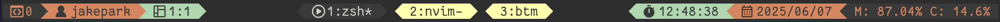
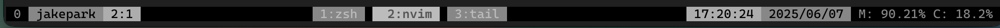

# tmux-status

> `jpark6/tmux-status` is simple tmux status plugin

## Preinstall
### Nerd Font
[Nerd Font github page](https://github.com/ryanoasis/nerd-fonts)
Need to install the Nerd Font for the icons to display properly.

this README.md page not support Nerd Font
therfore below set_icons icon charecter just display box charector
icon is :


### plugins
if want to see mem/cpu usage percent  
install [thewtex/tmux-mem-cpu-load](https://github.com/thewtex/tmux-mem-cpu-load)

## Install
### Tmux Plugin Manager (TPM)

add in `~/.tmux.conf`
```shell
set -g @plugin 'jpark6/tmux-status'
```

### Manual
Clone this repository in your `$HOME/.tmux/` directory:

```shell
git clone https://github.com/jpark6/tmux-status.git $HOME/.tmux/plugins/tmux-status
```

add to  `.tmux.conf` file:

```shell
run $HOME/.tmux/plugins/tmux-status/tmux-status.tmux
```

## Usage
- change `tmux-status.tmux` and reload plugin
1. change `tmux-status.tmux` main function
```shell
main() {
  ...
  # change below 2 lines
  set_color "default" "#16610E" "#F97A00" "#FED16A" "#FFF4A4" # green orange
  set_icons "" "" " " " " " " " " " " "󰸗 " " " " "

  status_left
  status_center
  status_right

  tmux set -g pane-active-border-style "fg=$color1"
}

```
2. reload `tmux-status.tmux` plugin
  - Reload tmux
    - press \<prefix\>+I (default: \<C-b\>+I)
  - or run `tmux-status.tmux`
    - press \<prefix>+: and type `:run /path/to/plugin/tmux-status.tmux`
    - type command in shell: `tmux run /path/to/plugin/tmux-status.tmux`

### Default 
- default color if don't set colors & icons
- separator : /
- color: green orange yellow
```shell
status_bg_color="default" # statusbar bg color default: terminal bg / light / dark
color1="#16610E" # session & MEM CPU bg color
color2="#F97A00" # username & date bg color
color3="#FED16A" # pane & time bg color
color4="#FFF4A4" # current window bg color

separator_start_icon=""
separator_end_icon=""
session_icon=" "
user_icon=" "
pane_icon=" "
status_current_icon=" "
time_icon=" "
date_icon="󰸗 "
mem_icon=" "
cpu_icon=" "
```


### Rounded Separators & Cyberpunk
```shell
  set_color "default" "#541690" "#FF4949" "#FF8D29" "#FFCD38" # cyberpunk - purple pink orange
  set_icons "" "" "󰥱 " "󰙄 " "󰪟 " "󰀨 " "󱑁 " "󰸗 " "󰰐 " "󰯲 "
```


### Wave Separators & Cold (status background light)
```shell
  set_color "light" "#11009E" "#8696FE" "#EEEEEE" "skyblue" # cold - blue lightpurple skyblue
  set_icons " " " " " " "󰙊 " "󰠡 " " " " " "󰸗 " " " " "
```


### Flame Separators & Red pearch Green
```shell
  set_color "default" "#A62C2C" "#E83F25" "#EA7300" "#D3CA79" # flame red orange yellow 
  set_icons " " "" "󱠇" "󰙊 " " " "󱓞 " "󰚱 " "󰸗 " " " " "
```


### Triangle & Brown Yellow
```shell
  set_color dark "#4B352A" "#CA7842" "#B2CD9C" "#F0F2BD"
  set_icons "" "" "󱃸 " " " "󱪳 " " " "󱎫 " "󰸘 " "M:" "C:"
```


### Inverse Triangle & Neon (Ansi Color - no hex color)
- Can Use ANSI Color
```shell
  set_color default teal green cyan yellow
  set_icons "" "" " " "󱚟 " "󰠡 " "󰣉 " "󱦟 " "󰸗 " "󰰐 " "󰯲 "
```


### No Seraprator No Icon & Olive Gray Color
```shell
  set_color "dark" "#626F47" "#A4B465" "#F5ECD5" "#F0BB78" # gray olive
  set_icons "" "" "" "" "" "" "" "" "MEM:" "CPU:" # use "" if don't want icon and seperator
```


### No Seraprator No Icon & black gray
```shell
  set_color "dark" "black" "#888888" "white" "gray" # black
  set_icons "" "" "" "" "" "" "" "" "MEM:" "CPU:" # use "" if don't want icon and seperator
```



