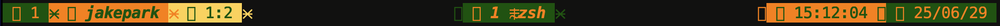
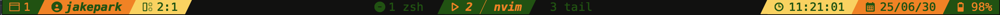
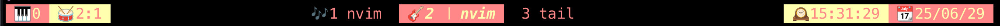
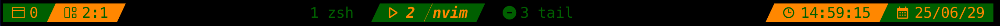
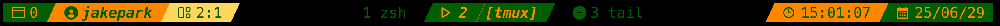

# tmux-status

> `jpark6/tmux-status` is simple tmux status plugin

## Preinstall
### Nerd Font
[Nerd Font github page](https://github.com/ryanoasis/nerd-fonts)
Need to install the Nerd Font for the icons to display properly.
- Not use Nerd Font

- Use Nerd Font


### plugins
If want to see mem/cpu usage percent  
Install [thewtex/tmux-mem-cpu-load](https://github.com/thewtex/tmux-mem-cpu-load)

## Install
### Tmux Plugin Manager (TPM)

add in `~/.tmux.conf`
```shell
set -g @plugin 'jpark6/tmux-status'
```

### Manual
Clone this repository in your `$HOME/.tmux/` directory:

```shell
git clone https://github.com/jpark6/tmux-status.git $HOME/.tmux/plugins/tmux-status
```

add to  `.tmux.conf` file:

```shell
run $HOME/.tmux/plugins/tmux-status/tmux-status.tmux
```
Install tmux plugin
```shell
<prefix>+I # default tmux <prefix> is Ctrl+b
```

## Usage
- change `~/.tmux.conf`  and reload plugin
1. set options in `~/.tmux.conf` 
  - You can change it to any colors, icons or separators.
```shell
# example color, icons, separators, user name, mem, cpu
set -g @tmux-status-colors "default,#FD8A8A,#F1F7B5,#A8D1D1" 
set -g @tmux-status-separators ",,｜,｜," 
set -g @tmux-status-icons "🖥 ,🤖 ,🪟 ,🎯,✨,⏳️,📅,M:,C:"
set -g @tmux-status-show-user-name off
set -g @tmux-status-show-mem-cpu off
```
- example options screenshot


2. reload `tmux-status.tmux` plugin
  - Reload tmux
    - press \<prefix\>+I (default: \<C-b\>+I)
  - or run `tmux-status.tmux`
    - press \<prefix>+: and type `:run /path/to/plugin/tmux-status.tmux`
    - type command in shell: `tmux run /path/to/plugin/tmux-status.tmux`

### Colors & Separators & Icons
#### Default
- if not set options in `~/.tmux.conf`
- applied default options 
  - separator :  # right upper triangle
  - color: green orange yellow
  - icon: normal icons
  - user name : off
  - mem cpu : off


#### Rounded Separators & Cyberpunk & round icons
```shell
set -g @tmux-status-colors "default,#541690,#FF4949,#FFCD38"
set -g @tmux-status-separators ",, , ,"
set -g @tmux-status-icons "󰥱 ,󰙄 ,󰪟 ,󰀨 , ,󱑁 ,󰸗 ,󰰐 ,󰯲 ,"
```


#### Triangle Separators & Nord Color & emoji icons 
```shell
set -g @tmux-status-colors "default,#88C0D0,#2E3440,#FFFFFF"
set -g @tmux-status-separators ",, , ,"
set -g @tmux-status-icons "🖥 ,🤖 ,🪟 ,🎯,✨,⏳️,📅, , ,"
```


### Wave Separators & Cold
```shell
set -g @tmux-status-colors "default,#006DFA,#8CB2F1,#D0CEDD"
set -g @tmux-status-separators " ,,,,"
set -g @tmux-status-icons "󰞍 ,󱝆 ,󱢋 ,󱢴 ,󱁕 ,󰄉 ,󰸗 , , ,"
```


#### Flame Separators & Red pearch Green
```shell
set -g @tmux-status-colors "default,#A62C2C,#E83F25,#EA7300"
set -g @tmux-status-separators " ,, , ,"
set -g @tmux-status-icons "󱠇 ,󰙊 , ,󱓞 , ,󱦟 ,󰸗 , , ,"
```


#### No Separator No Icon & Olive Gray Color
```shell
set -g @tmux-status-colors "default,#627F47,#A4B465,#F5ECD5"
set -g @tmux-status-separators ", "
set -g @tmux-status-icons ", "
```


### User Name
- I think the username is always the same value,
- so it doesn't really matter if it's not displayed,
- so I made it an on/off option.
#### No User Name
```shell
set -g @tmux-status-show-user-name "off" # off or "off"
```


#### Show User Name
```shell
set -g @tmux-status-show-user-name "on" # on of "on"
```



### Memory & CPU
#### No Memory & CPU Info
- If you don't want to see mem cpu info
- or not install tmux-mem-cpu-load plugin
```shell
set -g @tmux-status-mem-cpu "off" # off or "off"
```


#### Show Memory & CPU Info
```shell
set -g @tmux-status-show-mem-cpu "on" # on or "on"
```


###  Presets
- I commented the presets in `tmux-status.tmux`
- You can apply those settings to the `~.tmux.conf` file. 
- Or you can apply other values.

- `tmux-status.tmux`
```shell
  # Examples of colors / separators / icons
  # color references : https://colorhunt.co/
  set -g @tmux-status-colors "," # no colors - bg: transparent fg : theme main color
  set -g @tmux-status-colors "default,#16610E,#F97A00,#FED16A" # Forest - green orange yellow
  set -g @tmux-status-colors "default,#626F47,#A4B465,#F5ECD5" # OliveGray - olive gray white
  set -g @tmux-status-colors "default,#541690,#FF4949,#FFCD38" # Cyberpunk - purple pink orange
  set -g @tmux-status-colors "default,#050C9C,#3572EF,#3ABEF9" # Ocean - blue lightpurple skyblue
  set -g @tmux-status-colors "default,#FCC737,#F27B0F,#7E1891" # NeonYellow - yellow orange purple
  set -g @tmux-status-colors "default,#952F7C,#45CC38,#CAAC00" # NeonPurple
  set -g @tmux-status-colors "default,#EFE4D2,#254D70,#2F80BF" # WhiteGreen - white green blue
  set -g @tmux-status-colors "default,#96624C,#CC8A6A,#FABB85" # Coffee
  set -g @tmux-status-colors "default,#139E74,#BAFFE5,#E2FFF4" # Mint
  set -g @tmux-status-colors "default,#A62C2C,#E83F25,#EA7300" # Flame - red orange yellow 
  set -g @tmux-status-colors "default,#88C0D0,#2E3440,#FFFFFF" # Nord - skyblue darkgray white
  set -g @tmux-status-colors "default,#0A0047,#00FFD2,#FF4499" # TokyoNight - darkblue teal pink
  set -g @tmux-status-colors "default,#1A5319,#80AF81,#D6EFD8" # GradientGreen - gree dark → light
  set -g @tmux-status-colors "default,#AA60C8,#D69ADE,#FFDFEF" # GradientPurple
  set -g @tmux-status-colors "default,#3D90D7,#7AC6D2,#B5FCCD" # GradientBlue
  set -g @tmux-status-colors "default,#FA812F,#F3C623,#FEF3E2" # GradientOrange - orange dark → light
  set -g @tmux-status-colors "default,#4B352A,#CA7842,#B2CD9C" # PastelBrown -  brown yellow
  set -g @tmux-status-colors "default,#B1AFFF,#FDFDBD,#C8FFD4" # PastelPurple - purple ivory skyblue
  set -g @tmux-status-colors "default,#FD8A8A,#F1F7B5,#A8D1D1" # PastelPink - pink yellow blue
  set -g @tmux-status-colors "default,#00809D,#FCECDD,#FF7601" # PastelCyan - cyan white orange
  set -g @tmux-status-colors "default,#5EABD6,#FEFBC7,#FFB4B4" # PastlCyan2 - more bright
  set -g @tmux-status-colors "default,#FF4F33,#FFE6E1,#075B5E" # PastelPeach red peach green 
  set -g @tmux-status-colors "default,#005DFA,#8CB2F1,#D0CEDD" # Cold - blue skyblue white

  # separators and icon references : https://www.nerdfonts.com/cheat-sheet
  set -g @tmux-status-separators "," # no saparators
  set -g @tmux-status-separators ",,｜,｜,"
  set -g @tmux-status-separators ",,,,"
  set -g @tmux-status-separators ",, , ,"
  set -g @tmux-status-separators ",, , ,"
  set -g @tmux-status-separators ",,,,"
  set -g @tmux-status-separators ",, , ,"
  set -g @tmux-status-separators ",, , ,"
  set -g @tmux-status-separators ",, , ,"
  set -g @tmux-status-separators ",, , ,"
  set -g @tmux-status-separators ",, , ,"
  set -g @tmux-status-separators ",, , ,"
  set -g @tmux-status-separators ",, , ,"
  set -g @tmux-status-separators ",, , ,"
  set -g @tmux-status-separators ",, , ,"
  set -g @tmux-status-separators ",, , ,"
  set -g @tmux-status-separators " ,,｜,｜,"
  set -g @tmux-status-separators " ,, , ,"
  set -g @tmux-status-separators " , ,｜,｜,"

  set -g @tmux-status-icons "," # no icons
  set -g @tmux-status-icons "󰒋 ,󱟄, ,  ,󰄬 ,󱦟 ,󰸗 , , ,"
  set -g @tmux-status-icons "󰒋 ,󱟄, ,  , ,󱦟 ,󰸗 , , ,"
  set -g @tmux-status-icons "󰹕 ,󰶪 ,󰃥 , 󰙏 ,󰸕 ,󱫍 , ,i, ,"  # study
  set -g @tmux-status-icons "󰠴 ,󰑮 ,󱉾  ,  ,󰦶 ,󰔛 , , , ,"  # sport
  set -g @tmux-status-icons "🖥 ,🤖 ,🪟 ,🎯,✨,⏳️,📅, , ,"
  set -g @tmux-status-icons " , ,󰙄 ,󰣉 ,󰆤,󱎫 ,󰸘 , , ,"  # icon / no sep
  set -g @tmux-status-icons "🧱,👷,🪟 ,🏗 ,🚧,⏳️,📅, ,,,"
  set -g @tmux-status-icons "🌃,😪,🪟 ,🌙,💤,⏳️,📅, ,,,"
  set -g @tmux-status-icons "🎹,🕺,🥁,🎸,🎶,🕰 ,📆,󰰐 ,󰯲 ,"
  set -g @tmux-status-icons "🏟 ,🏊,🏓,⚽ ,🥅,⏳️,📆,󰰐 ,󰯲 ,"
  set -g @tmux-status-icons "🏔 ,⛄,🚠 ,🏂 ,🍧,⌚️,🎄,󰰐 ,󰯲 ,"
  set -g @tmux-status-icons " , , , , , ,󰸗 , , ,"
  set -g @tmux-status-icons " , , ,󰎇 ,󰽺 , ,󰸗 , , ,"
  set -g @tmux-status-icons "󰒋 ,󰙌, , , , ,󰸗 , , ,"
  set -g @tmux-status-icons " , , ,󱝂 , , ,󰸗 , , ,"
  set -g @tmux-status-icons "󰒋 , ,󱪳 ,󰠳 , ,󱎫 ,󰸘 ,M:,C:,"
  set -g @tmux-status-icons "󱃸 , ,󱪳 ,󰠳 , ,󱎫 ,󰸘 ,M:,C:,"
  set -g @tmux-status-icons " ,󱗌 ,󰕮 ,󰖙 , ,󱎫 ,󰸘 ,󰰐 ,󰯲 ,"
  set -g @tmux-status-icons "  ,󰙄 ,󱪳 , , ,󱎫 ,󰸘 ,󰰐 ,󰯲 ,"
  set -g @tmux-status-icons " ,󱚟 ,󰠡 ,󰣉 , ,󱦟 ,󰸗 ,󰰐 ,󰯲 ,"
  set -g @tmux-status-icons " , , , , , ,󰸗 , , ,"
  set -g @tmux-status-icons "󰥱 ,󰙄 ,󰪟 ,󰀨 , ,󱑁 ,󰸗 ,󰰐 ,󰯲 ,"
  set -g @tmux-status-icons " ,󱎂 ,󰠡 ,󱝆 ,󱁕,󰄉 ,󰸗 , , ,"
  set -g @tmux-status-icons "󰞍 ,󱝆 ,󱢋 ,󱢴 ,󱁕 ,󰄉 ,󰸗 , , ,"
  set -g @tmux-status-icons "󱠇 ,󰙊 , ,󱓞 , ,󱦟 ,󰸗 , , ,"
  set -g @tmux-status-icons "󰕲 ,󰙄 , ,󰣉 , ,󱦟 ,󰸗 , , ,"

```
