# tmux-iconcolor-status

- `tmux-iconcolor-status` tmux plugin that displays useful information in the tmux status line, such as session window, pane, cpu, mem, battery  
- Can easily modify the color, icon, and separators of the status bar


## 🎯 Features

- Display system information like CPU, memory, and battery 
- Easily change color/separator/icon

## ⚠️Preinstall
### Nerd Font
[Nerd Font github page](https://github.com/ryanoasis/nerd-fonts)
- Need to install the Nerd Font for the icons to display properly.
- No use Nerd Font
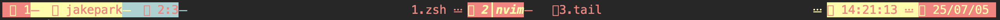
- Use Nerd Font


### plugins
[thewtex/tmux-mem-cpu-load](https://github.com/thewtex/tmux-mem-cpu-load)
- show cpu mem percentage

[tmux-plugins/tmux-battery](https://github.com/tmux-plugins/tmux-battery)
- show battary status and percentage


## 🔨 Install
###  Tmux Plugin Manager (TPM)

- add in `~/.tmux.conf`
```shell
set -g @plugin 'jpark6/tmux-iconcolor-status'
```

### Manual
- Clone this repository in your `$HOME/.tmux/` directory:

  ```shell
  git clone https://github.com/jpark6/tmux-iconcolor-status.git $HOME/.tmux/plugins/tmux-iconcolor-status
  ```

- add to  `.tmux.conf` file:

  ```shell
  run $HOME/.tmux/plugins/tmux-iconcolor-status/iconcolor-status.tmux
  ```

### Install Plugin
- For both TPM and Manual methods, you must enter the install command.
  ```shell
  <prefix>+I # default tmux <prefix> is Ctrl+b
  # or
  tmux source-file ~/.tmux.conf
  ```

## Usage
- change `~/.tmux.conf`  and reload plugin
1. set options in `~/.tmux.conf` 
  - You can change it to any colors, icons or separators.
  - colors : "status_bg,color1,color2,color3"
    - status_bg : default: transparent, dark/black : theme dark color, light/white : theme light color, #[A-Fa-f0-9]{6} : rgb hex color
    - color1 : main color, color2 : sub color, color3 : third color
  - separators "section_left,section_right,separator_left,separator_right"
  - icons "session,user,pane,current window,last windows, zoomed window,time,date,cpu,memory,charged,discharged,charging"
```shell
# example color, icons, separators, user name, mem, cpu
set -g @iconcolor-colors "#FD8A8A,#F1F7B5,#A8D1D1,default" # PastelPink - pink yellow blue
set -g @iconcolor-separators " , ,┃,┃," # pixel
set -g @iconcolor-icons " , ,󰙄 ,󰣉 ,󰆤 , ,󱎫 ,󰸘 , , , ,󰁾 ,󰢝 ,"  # target
set -g @iconcolor-show-user-name on
set -g @iconcolor-show-cpu-mem off
set -g @iconcolor-show-battery off
```
- example options screenshot
- light terminal theme
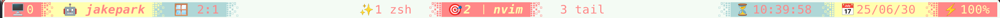
- dark terminal theme
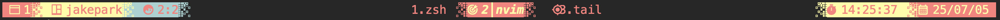

2. reload `iconcolor.tmux` plugin
  - Reload tmux
  ```shell
  <prefix>+I # default tmux <prefix> is Ctrl+b
  # or
  tmux source-file ~/.tmux.conf
  ```

## Colors & Separators & Icons
### Default
- if not set options in `~/.tmux.conf`
- applied default options 
  - separator : none
  - color: fg: terminal fg bg: terminal bg
  - icon: no icon
  - user name : on
  - cpu mem : off
  - battery : off


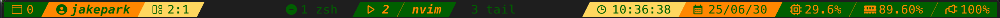

### Rounded Separators & Cyberpunk & round icons
```shell
set -g @iconcolor-separators ",, , ," # round
set -g @iconcolor-colors "#541690,#FF4949,#FFCD38,default" # Cyberpunk - purple pink orange
set -g @iconcolor-icons "󰥱 ,󰙄 ,󰪟 ,󰀨 , , ,󱑁 ,󰸗 ,󰯲 ,󰰐 , ,󰁾 ,󰢝 ," # important
```


### Triangle Separators & Nord Color & emoji icons 
```shell
set -g @iconcolor-colors "#88C0D0,#2E3440,#FFFFFF,default" # Nord - skyblue darkgray white
set -g @iconcolor-separators ",, , ," # triangle right > >
set -g @iconcolor-icons "🖥 ,🤖 ,🪟 ,🎯,✨,🔍,⏳️,📅, , ,⚡️,🪫,🔋," # target emoji
```


### Wave Separators & Cold & beach icons
```shell
set -g @iconcolor-colors "#005DFA,#8CB2F1,#D0CEDD,default" # Cold - blue skyblue white
set -g @iconcolor-separators " ,,┃,┃," # wave
set -g @iconcolor-icons " ,󱎂 ,󰠡 ,󱝆 ,󱁕, ,󰄉 ,󰸗 , , , ,󰁾 ,󰢝 ," # surf
```
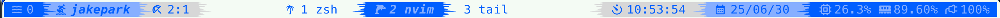
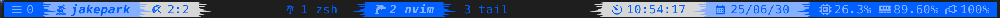

### Flame Separators & Red
```shell
set -g @iconcolor-colors "#A62C2C,#E83F25,#EA7300,#FFFFFF" # Flame - red orange yellow 
set -g @iconcolor-separators " ,, , ," # flame
set -g @iconcolor-icons "󱠇 ,󰙊 , ,󱓞 , , ,󱦟 ,󰸗 , , , ,󰁾 ,󰢝 ," # hello

```

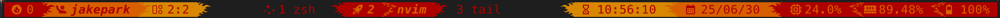

### No Separator No Icon & Olive 
```shell
set -g @iconcolor-colors "default,#627F47,#A4B465,#F5ECD5"
set -g @iconcolor-separators ", "
set -g @iconcolor-icons ", "
```


## User Name
- username is always the same value,
- so it doesn't matter if it's not displayed,
- set on/off to show or hide username
- default : on
### No User Name
```shell
set -g @iconcolor-show-user-name "off" # off or "off"
```

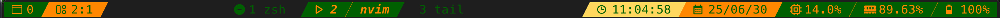

### Show User Name
```shell
set -g @iconcolor-show-user-name "on" # on of "on"
```
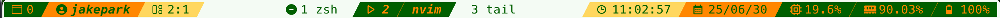
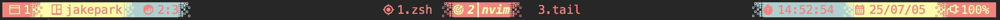

## CPU & Memory
### No CPU & Memory Info
- If you don't want to see cpu mem info
- or not install [thewtex/tmux-mem-cpu-load](https://github.com/thewtex/tmux-mem-cpu-load) plugin
- default : off
```shell
set -g @iconcolor-show-cpu-mem "off" # off or "off"
```
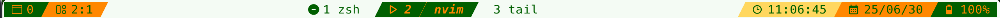
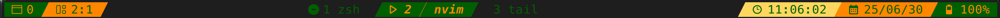

### Show CPU & Memory Info
```shell
set -g @iconcolor-show-cpu-mem "on" # on or "on"
```
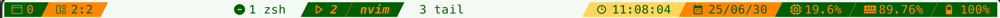
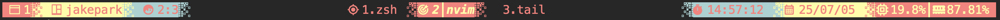

## battery
### No battery Info
- If you don't want to see battery info
- or not install [tmux-plugins/tmux-battery](https://github.com/tmux-plugins/tmux-battery) plugin
- default : off
```shell
set -g @iconcolor-show-battery "off" # off or "off"
```
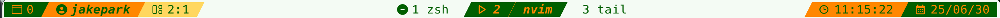
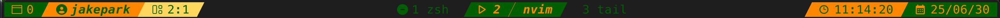

### Show Battery Info
```shell
set -g @iconcolor-show-battery "on" # on or "on"
```
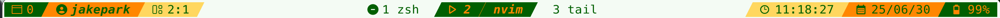
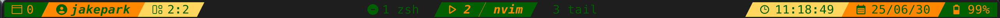

##  Presets
- Presets in `preset.sh`
- You can apply those settings to the `~.tmux.conf` file. 
- Or you can apply any other settings.

