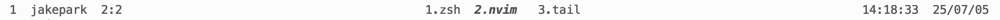

# tmux-iconcolor-status

- `tmux-iconcolor-status` tmux plugin that displays useful information in the tmux status line, such as session window, pane, cpu, mem, battery  
- Can easily modify the color, icon, and separators of the status bar


## 🎯 Features

- Display system information like CPU, memory, and battery 
- Easily change color/separator/icon

## ⚠️Preinstall
### Nerd Font
[Nerd Font github page](https://github.com/ryanoasis/nerd-fonts)
- Need to install the Nerd Font for the icons to display properly.
- No use Nerd Font

- Use Nerd Font


### plugins
[tmux-plugins/tmux-cpu](https://github.com/tmux-plugins/tmux-cpu)
- show cpu mem percentage

[tmux-plugins/tmux-battery](https://github.com/tmux-plugins/tmux-battery)
- show battary status and percentage


## 🔨 Install
###  Tmux Plugin Manager (TPM)

- add in `~/.tmux.conf`
```shell
set -g @plugin 'jpark6/tmux-iconcolor-status'
```

### Manual
- Clone this repository in your `$HOME/.tmux/` directory:

  ```shell
  git clone https://github.com/jpark6/tmux-iconcolor-status.git $HOME/.tmux/plugins/tmux-iconcolor-status
  ```

- add to  `.tmux.conf` file:

  ```shell
  run $HOME/.tmux/plugins/tmux-iconcolor-status/iconcolor-status.tmux
  ```

### Install Plugin
- For both TPM and Manual methods, you must enter the install command.
  ```shell
  <prefix>+I # default tmux <prefix> is Ctrl+b
  # or
  tmux source-file ~/.tmux.conf
  ```

## ✍️ Usage
- change `~/.tmux.conf`  and reload plugin
1. set options in `~/.tmux.conf` 
    - use `@iconcolor-theme`
    ```shell
    set -g @iconcolor-theme "pastel,pixel,target"
    set -g @iconcolor-show-user-name on
    set -g @iconcolor-show-cpu-mem off
    set -g @iconcolor-show-battery on
    ```

    - use `@iconcolor-colors`, `@iconcolor-separators`, `@iconcolor-icons`
    ```shell
    set -g @iconcolor-colors "#FD8A8A,#F1F7B5,#A8D1D1,default" # PastelPink - pink yellow blue
    set -g @iconcolor-separators " , ,┃,┃," # pixel
    set -g @iconcolor-icons " , ,󰙄 ,󰣉 ,󰆤 , ,󱎫 ,󰸘 , , , ,󰁾 ,󰢝 ,"  # target
    set -g @iconcolor-show-user-name on
    set -g @iconcolor-show-cpu-mem off
    set -g @iconcolor-show-battery on
    ```

2. reload `iconcolor-status.tmux` plugin
   - Reload tmux
   ```shell
   <prefix>+I # default tmux <prefix> is Ctrl+b
   # or
   tmux source-file ~/.tmux.conf
   ```

## Colors & Separators & Icons
  - Theme: For simple applying of colors, separators, and icons, use `@iconcolor-theme`
  - Preset: For detailed applying of colors, separators, and icons, use `@iconcolor-colors`, `@icon-separartors`, and `@iconcolor-icons`
  - If set both theme option and preset options, the theme option is applied and then overwritten by the preset options
  - It doesn't matter which option was declared first.

### Default
- if not set options in `~/.tmux.conf`
- applied default options 
  - separator : none
  - color: fg: terminal fg bg: terminal bg
  - icon: no icon
  - user name : on
  - cpu mem : off
  - battery : off




### Theme
- set `@iconcolor-theme` 
- parameter: "colors theme, separators theme, icons theme"
- theme list
  - colors theme:
    forest,olivegray,cyberpunk,ocean,neon-yellow,neon-purple,whitegreen,coffee,mint,flame,nord,tokyonight,gradient-green,gradient-purple,gradient-blue,gradient-orange,pastel-brown,pastel-purple,pastel-cyan,pastel-cyan2,pastel-peach,cold,
  - separators theme:
    round,slant-left,slant-down,slant-up,triangle-both,triangle-left,triangle-right,triangle-inverse,wave,flame,pixel,
  - icons theme:
    none,target-emoji,construction-emoji,night-emoji,music-emoji,sport-emoji,winter-emoji,target,ship,airplain,study,sport,curvedarrow,music,biohazard,star,steeringwheel,sun,playround,target,play,important,surf,wave,hello,target,winter,

#### Pastel & Pixcel
```shell
set -g @iconcolor-theme "pastel,pixel,target-emoji"
```


#### Gradient Green & Slant
```shell
set -g @iconcolor-theme "gradient-green,slant-right,airplain"
```  


#### Red & Flame
```shell
set -g @iconcolor-theme "flame,flame,hello"
```


#### Nord & Triangle right
```shell
set -g @iconcolor-theme "nord,triangle-right,star"

```


### Preset 
- set `@iconcolor-colors` 
  - parameter: "color1, color2, color3, bg"
- set `@iconcolor-separators` 
  - parameter: "section left, section right, separator left, separator right"
- set `@iconcolor-icons` 
  - parameter: "session,user,pane,current window,last window,zoomed window,time,date,charged,uncharging,charging"
- Presets in `preset.sh`
- Can apply those settings to the `~.tmux.conf` file. 
- Or you can apply any other settings.

#### Cyberpunk & Rounded 
```shell
set -g @iconcolor-colors "#541690,#FF4949,#FFCD38,default" # Cyberpunk - purple pink orange
set -g @iconcolor-separators ",, , ," # round
set -g @iconcolor-icons "󰥱 ,󰙄 ,󰪟 ,󰀨 , , ,󱑁 ,󰸗 ,󰯲 ,󰰐 , ,󰁾 ,󰢝 ," # important
```


### Cold & Wave
```shell
set -g @iconcolor-colors "#005DFA,#8CB2F1,#D0CEDD,default" # Cold - blue skyblue white
set -g @iconcolor-separators " ,,┃,┃," # wave
set -g @iconcolor-icons " ,󱎂 ,󰠡 ,󱝆 ,󱁕, ,󰄉 ,󰸗 , , , ,󰁾 ,󰢝 ," # surf
```


### Only Olive Text & No Separators No Icons
- Only set color1, the background will be transparent and the text will be color1.
- Set separators and icons to "," because if set them to "", the shell script will say they have no value.
```shell
set -g @iconcolor-colors "#627F47"
set -g @iconcolor-separators ","
set -g @iconcolor-icons ","
```


## Toggle Status
### User Name
- username is always the same value,
- so it doesn't matter if it's not displayed,
- set on/off to show or hide username
- default : on
#### No User Name
```shell
set -g @iconcolor-show-user-name "off" # off or "off"
```


#### Show User Name
```shell
set -g @iconcolor-show-user-name "on" # on of "on"
```


### CPU & Memory
#### No CPU & Memory Info
- If you don't want to see cpu mem info
- or not install [tmux-plugins/tmux-cpu](https://github.com/tmux-plugins/tmux-cpu) plugin
- default : off
```shell
set -g @iconcolor-show-cpu-mem "off" # off or "off"
```


#### Show CPU & Memory Info
```shell
set -g @iconcolor-show-cpu-mem "on" # on or "on"
```


### battery
#### No battery Info
- If you don't want to see battery info
- or not install [tmux-plugins/tmux-battery](https://github.com/tmux-plugins/tmux-battery) plugin
- default : off
```shell
set -g @iconcolor-show-battery "off" # off or "off"
```


#### Show Battery Info
```shell
set -g @iconcolor-show-battery "on" # on or "on"
```


