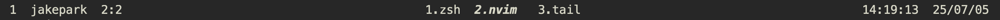
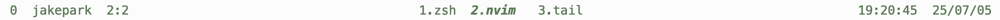
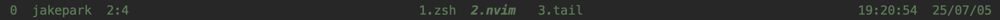
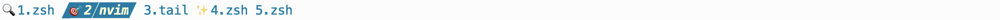
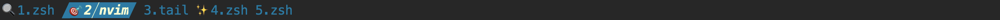

# tmux-iconcolor-status

- `tmux-iconcolor-status` tmux plugin that displays useful information in the tmux status line, such as session window, pane, cpu, mem, battery  
- Can easily modify the color, icon, and separators of the status bar


## 🎯 Features

- Display system information like CPU, memory, and battery 
- Easily change color/separator/icon

## ⚠️Preinstall
### Nerd Font
[Nerd Font github page](https://github.com/ryanoasis/nerd-fonts)
- Need to install the Nerd Font for the icons to display properly.
- No use Nerd Font

- Use Nerd Font


### plugins
[tmux-plugins/tmux-cpu](https://github.com/tmux-plugins/tmux-cpu)
- show cpu mem percentage

[tmux-plugins/tmux-battery](https://github.com/tmux-plugins/tmux-battery)
- show battary status and percentage


## 🔨 Install
###  Tmux Plugin Manager (TPM)

- add in `~/.tmux.conf`
```bash
set -g @plugin 'jpark6/tmux-iconcolor-status'
```

### Manual
- Clone this repository in your `$HOME/.tmux/` directory:

  ```bash
  git clone https://github.com/jpark6/tmux-iconcolor-status.git $HOME/.tmux/plugins/tmux-iconcolor-status
  ```

- add to  `.tmux.conf` file:

  ```bash
  run $HOME/.tmux/plugins/tmux-iconcolor-status/iconcolor-status.tmux
  ```

### Install Plugin
- For both TPM and Manual methods, you must enter the install command.
  ```bash
  <prefix>+I # default tmux <prefix> is Ctrl+b
  # or
  tmux source-file ~/.tmux.conf
  ```

## ✍️ Usage
- change `~/.tmux.conf`  and reload plugin
1. set options in `~/.tmux.conf` 
    - use `@iconcolor-theme`
    ```bash
    set -g @iconcolor-theme "pastel,pixel,target"

    set -g @iconcolor-show-session on
    set -g @iconcolor-show-user on
    set -g @iconcolor-show-pane on
    set -g @iconcolor-show-time on
    set -g @iconcolor-show-date on
    set -g @iconcolor-show-cpu-mem on
    set -g @iconcolor-show-battery on
    ```

    - use `@iconcolor-colors`, `@iconcolor-separators`, `@iconcolor-icons`
    ```bash
    set -g @iconcolor-colors "#FD8A8A,#F1F7B5,#A8D1D1,default" # PastelPink - pink yellow blue
    set -g @iconcolor-separators " , ,┃,┃," # pixel
    set -g @iconcolor-icons " , ,󰙄 ,󰣉 ,󰆤 , ,󱎫 ,󰸘 , , , ,󰁾 ,󰢝 ,"  # target

    set -g @iconcolor-show-session on
    set -g @iconcolor-show-user on
    set -g @iconcolor-show-pane on
    set -g @iconcolor-show-time on
    set -g @iconcolor-show-date on
    set -g @iconcolor-show-cpu-mem on
    set -g @iconcolor-show-battery on
    ```

2. reload `iconcolor-status.tmux` plugin
   - Reload tmux
   ```bash
   <prefix>+I # default tmux <prefix> is Ctrl+b
   # or
   tmux source-file ~/.tmux.conf
   ```

## Colors & Separators & Icons
  - Theme: For simple applying of colors, separators, and icons, use `@iconcolor-theme`
  - Preset: For detailed applying of colors, separators, and icons, use `@iconcolor-colors`, `@icon-separartors`, and `@iconcolor-icons`
  - If set both theme option and preset options, the theme option is applied and then overwritten by the preset options
  - It doesn't matter which option was declared first.

### Default
- if not set options in `~/.tmux.conf`
- applied default options 
  - separator : none
  - color: fg: terminal fg bg: terminal bg
  - icon: no icon
  - user name : on
  - cpu mem : off
  - battery : off




### Theme
- set `@iconcolor-theme` 
- parameter: "colors theme, separators theme, icons theme"
- theme list
    - colors:  
      coffee,cold,cyberpunk,flame,forest,gradient-blue,gradient-green,gradient-orange,gradient-purple,mint,neon-purple,neon-yellow,nord,ocean,olivegray,pastel-brown,pastel-cyan,pastel-cyan2,pastel-peach,pastel-purple,tokyonight,whitegreen  

    - separators:  
      round,flame,none,pixel,slant-down,slant-left,slant-up,triangle-inverse,triangle-left,triangle-right,wave

    - icons:  
      construction-emoji,music-emoji,night-emoji,sport-emoji,target-emoji,winter-emoji,airplane,biohazard,curvedarrow,hello,important,music,play,playround,ship,sport,star,steeringwheel,study,sun,surf,target,target,wave,winter,


#### Pastel Colors & Pixcel Separators & Target Emoji Icon(Current Window)
```bash
set -g @iconcolor-theme "pastel,pixel,target-emoji"
```


#### Gradient Green Colors & Slant Separators & Airplane Icon
```bash
set -g @iconcolor-theme "gradient-green,slant-right,airplane"
```  


#### Frame Colors & Flame Separators & Rocket Icon
```bash
set -g @iconcolor-theme "flame,flame,rocket"
```


#### Nord Colors & Triangle right Separators & Star Icon(Current Window)
```bash
set -g @iconcolor-theme "nord,triangle-right,star"

```


### Preset 
- set `@iconcolor-colors` 
  - parameter: "color1, color2, color3, bg"
- set `@iconcolor-separators` 
  - parameter: "section left, section right, separator left, separator right"
- set `@iconcolor-icons` 
  - parameter: "session,user,pane,current window,last window,zoomed window,time,date,charged,uncharging,charging"
- Presets in `preset.sh`
- Can apply those settings to the `~.tmux.conf` file. 
- Or you can apply any other settings.

#### Cyberpunk Colors & Rounded  Separators & round Icons
```bash
set -g @iconcolor-colors "#541690,#FF4949,#FFCD38,default" # Cyberpunk - purple pink orange
set -g @iconcolor-separators ",, , ," # round
set -g @iconcolor-icons "󰥱 ,󰙄 ,󰪟 ,󰀨 , , ,󱑁 ,󰸗 ,󰯲 ,󰰐 , ,󰁾 ,󰢝 ," # important
```


#### Cold Colors & Wave Separators & Surf Icons
```bash
set -g @iconcolor-colors "#005DFA,#8CB2F1,#D0CEDD,default" # Cold - blue skyblue white
set -g @iconcolor-separators " ,,┃,┃," # wave
set -g @iconcolor-icons " ,󱎂 ,󰠡 ,󱝆 ,󱁕, ,󰄉 ,󰸗 , , , ,󰁾 ,󰢝 ," # surf
```


#### Only Olive Text & No Separators No Icons
- Only set color1, the background will be transparent and the text will be color1.
- Set separators and icons to "," because if set them to "", the shell script will say they have no value.
```bash
set -g @iconcolor-colors "#627F47"
set -g @iconcolor-separators ","
set -g @iconcolor-icons ","
```




## Toggle Status
- Toggle all options for status-left and status-light on/off
- set option in `~/.tmux.conf`
```bash
set -g @iconcolor-show-session on # on / off
set -g @iconcolor-show-user on # on / off
set -g @iconcolor-show-pane on # on / off
set -g @iconcolor-show-time on # on / off
set -g @iconcolor-show-date on # on / off
set -g @iconcolor-show-cpu-mem on # on / off
set -g @iconcolor-show-battery on # on / off
```
### Default
- Not set any `icon-color-show-*` option 
- | session | user | pane | ... windows ... | time | date |


### All Off 
- Set all `@iconcolor-show-*` values to off
- When set to all off, window status is aligned to the left.



## User / Date / Time Format
### User
- set in `~/.tmux.conf`
```
set -g @iconcolor-user-format "#(whoami)"
```
#### format list
|Format Code|Meaning|Example Output|
|:-|:-|:-|
|`#(whoami)`|username |jakepark|
|`#H`|hostname|Jakeui-MacBookAir.local|

#### screenshot
|Value|Images|
|-|-|
|`"#(whoami)"` or `""`|  |
|`"#H"`| |
|`"#(whoami)@#H"`| |

### Time / Date Format
- set in `~/.tmux.conf`
```
set -g @iconcolor-time-format "%X" # HH24:MM:SS
set -g @iconcolor-date-format "%y/%m/%d" # YY/MM/DD
```
|Format Code|Meaning|Example Output|
|:-|:-|:-|
|`%H`|Hour (24-hour format, 00–23)|14|
|`%I`|Hour (12-hour format, 01–12)|02|
|`%M`|Minute (00–59)|07|
|`%S`|Second (00–60)|45|
|`%p`|AM/PM (uppercase)|PM|
|`%P`|am/pm (lowercase)|pm|
|`%A`|Full weekday name|Saturday|
|`%a`|Abbreviated weekday name|Sat|
|`%B`|Full month name|July|
|`%b`|Abbreviated month name|Jul|
|`%Y`|Year (4 digits)|2025|
|`%y`|Year (2 digits)|25|
|`%m`|Month (01–12)|07|
|`%d`|Day of the month (01–31)|05|
|`%j`|Day of the year (001–366)|186|
|`%Z`|Time zone abbreviation|KST|
|`%z`|Time zone offset from UTC|+0900|
|`%c`|Local date and time string|Sat Jul 5 14:23:00 2025|
|`%x`|Local date format|07/05/25|
|`%X`|Local time format|14:23:00|

#### screenshot
- time

|Value|Images|
|-|-|
|`"%H:%M:%S"`| |
|`"%p %I:%M"`| |

- date

|Value|Images|
|-|-|
|`"%y/%m/%d"`| |
|`"%m/%d"`| |
|`"%A %B %d %Y"`| |
|`"%c"`| |

